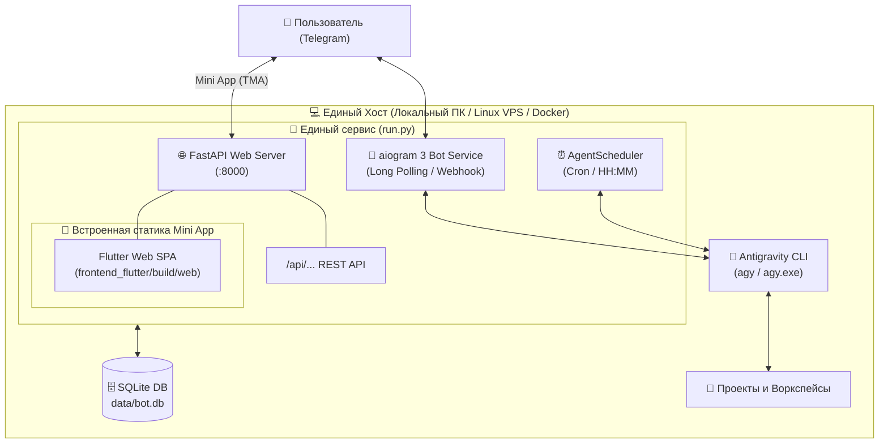

# Генеральный План Развития: Antigravity Universal Hub (All-in-One)

Данный документ представляет собой детальный утверждённый мастер-план трансформации системы **Antigravity Telegram Bot & Flutter Mini App** в универсальный, платформонезависимый комплекс управления агентом Google Antigravity.

---

## 📑 Оглавление
1. [Стратегическое видение и принципы All-in-One](#-1-стратегическое-видение-и-принципы-all-in-one)
2. [Архитектурная схема системы](#-2-архитектурная-схема-системы)
3. [Детализация этапов реализации](#-3-детализация-этапов-реализации)
   * [Этап 1: Платформонезависимость ядра (Core Agnostic)](#этап-1-платформонезависимость-ядра-core-agnostic)
   * [Этап 2: Автономный All-in-One хостинг Mini App](#этап-2-автономный-all-in-one-хостинг-mini-app)
   * [Этап 3: Интерактивный мастер установки в одну команду](#этап-3-интерактивный-мастер-установки-в-одну-команду)
   * [Этап 4: Контейнеризация и упаковка (Docker & Systemd)](#этап-4-контейнеризация-и-упаковка-docker--systemd)
   * [Этап 5: Мультимодальность Telegram-бота и логирование](#этап-5-мультимодальность-telegram-бота-и-логирование)
   * [Этап 6: Flutter Mini App 2.0 (Интерактивный дашборд)](#этап-6-flutter-mini-app-20-интерактивный-дашборд)
4. [Спринты и график выполнения](#-4-спринты-и-график-выполнения)

---

## 🌟 1. Стратегическое видение и принципы All-in-One

### Главная цель
Обеспечить возможность развёртывания и полноценной работы **всей системы целиком на одной машине** (локальный ПК Windows/Linux/macOS, удалённый VPS-сервер или Docker-контейнер).

### Ключевые архитектурные принципы
1. **Единый хост и моно-сервис (All-in-One)**:
   * Запуск одной командой `python run.py`.
   * Telegram-бот (aiogram 3), веб-сервер (FastAPI), раздача Flutter Web SPA, SQLite база данных и фоновый шедулер запускаются внутри одного процесса в общем `asyncio event loop`.
   * Никакой обязательной зависимости от внешних серверов, Nginx или Proxmox.
2. **Нулевой хардкод (Zero Infrastructure Hardcode)**:
   * Полное исключение любых привязок к IP-адресам (например, `192.168.1.101`), именам контейнеров или специфике конкретной ОС.
   * Динамическое определение характеристик хоста при старте.
3. **Установка в одну команду (Zero-Friction Setup)**:
   * Интерактивный CLI-мастер установки с дружелюбным диалогом, автоматической проверкой зависимостей, генерацией `.env` и настройкой автозапуска.

---

## 🗺 2. Архитектурная схема системы



---

## 📋 3. Детализация этапов реализации

### Этап 1: Платформонезависимость ядра (Core Agnostic)
* **Устранение хардкода Proxmox**:
  * В [`src/agent/manager.py`](file:///d:/Projects/active/antigravity_bot/src/agent/manager.py) заменить статический контекст на динамический сбор информации:
    ```python
    f"Хост: {platform.node()}, ОС: {platform.system()} {platform.release()} ({platform.machine()})"
    ```
  * Добавить в [`src/config.py`](file:///d:/Projects/active/antigravity_bot/src/config.py) параметр `system_context_hint: str = ""` для передачи кастомных инструкций окружения через `.env` (если необходимо).
* **Кроссплатформенный поиск бинарника `agy`**:
  * Реализовать многоуровневый поиск:
    1. Переменная `AGY_BIN_PATH` в `.env` (если задана явно).
    2. Системный `PATH` (`shutil.which("agy")` / `shutil.which("agy.exe")`).
    3. Стандартные пути Linux/macOS: `~/.local/bin/agy`, `~/.agy/bin/agy`, `/usr/local/bin/agy`, `/usr/bin/agy`.
    4. Стандартные пути Windows: `%LOCALAPPDATA%\agy\bin\agy.exe`.
* **Универсальные пути воркспейсов**:
  * Обеспечить валидное создание и нормализацию путей как в Linux (`/root/projects/...`), так и в Windows (`D:\Projects\...`).

---

### Этап 2: Автономный All-in-One хостинг Mini App
* **SPA Fallback в FastAPI**:
  * Настроить обработку маршрутов в [`src/server/app.py`](file:///d:/Projects/active/antigravity_bot/src/server/app.py): все GET-запросы, не начинающиеся с `/api/`, перенаправлять на `index.html` собранного Flutter Web. Это гарантирует работу клиентского роутинга без внешнего Nginx.
* **Скрипты сборки веба**:
  * Создать кроссплатформенные скрипты сборки:
    * `scripts/build_web.sh` (для Linux/macOS).
    * `scripts/build_web.ps1` (для Windows).
* **Автономная работа на одном порту**:
  * Доступ к API и интерфейсу Mini App осуществляется через один общий порт (по умолчанию `:8000`).

---

### Этап 3: Интерактивный мастер установки в одну команду
* **Интерактивный CLI-мастер (`setup.py` / `install.sh`)**:
  * Пошаговый цветной диалог с пользователем в терминале:
    1. 🤖 **Telegram Bot Token**: токен бота от @BotFather (с валидацией формата).
    2. 👤 **Telegram Admin ID**: цифровой ID администратора (с подсказкой о @userinfobot).
    3. 🌐 **Домен и SSL для Telegram Mini App (WEBAPP_URL)**:
       * *Принцип Telegram:* Mini App внутри клиента Telegram на смартфонах и ПК **строго требует доверенный `https://`** с валидным публичным SSL-сертификатом (открытие `http://` блокируется платформой).
       * *Вариант 1 (Автоматический Nginx + Certbot Let's Encrypt)*: мастер запрашивает домен, проверяет DNS (`socket.gethostbyname`), сам устанавливает `nginx`, `certbot`, `python3-certbot-nginx`, создаёт конфиг проксирования на `127.0.0.1:PORT`, открывает порты 80/443 в UFW/firewalld, выпускает официальный SSL-сертификат и прописывает `WEBAPP_URL=https://<домен>`.
       * *Вариант 2 (Готовый HTTPS URL)*: для пользователей со своим Nginx Proxy Manager, Traefik или SSH-туннелем к VPS.
       * *Вариант 3 (Пропуск)*: для локальных ПК без домена/сервера — бот работает на 100% через чат (текст, голос, файлы, задачи), а неработающая кнопка Mini App скрывается из интерфейса.
    4. 🔌 **Порт веб-сервера**: по умолчанию `8000`.
    5. 🛡 **Режим подтверждения**: `/auto` (автономный) или `/confirm` (с подтверждением опасных действий).
    6. 🧠 **Модель по умолчанию**: выбор из каталога (`gemini-3.7-flash`, `claude-sonnet-4.6`, etc.).
* **Автоматические действия мастера**:
  * Проверка версии Python (3.10+).
  * Создание виртуального окружения `venv` и установка библиотек из `requirements.txt`.
  * Проверка наличия бинарника `agy` (с авто-установкой официального CLI при отсутствии).
  * Проверка/распаковка скомпилированного Flutter Web (из архива `miniapp_web.tar.gz`).
  * Автоматическая установка и выпуск SSL-сертификатов Let's Encrypt через Nginx + Certbot.
  * Генерация валидного файла `.env`.
  * Инициализация базы данных SQLite (`data/bot.db`).
  * *Для Linux:* создание и регистрация systemd-службы `antigravity-bot.service`.
  * *Для Windows:* создание удобных батников и ярлыков автозапуска.

---

### Этап 4: Контейнеризация и упаковка (Docker & Systemd)
* **`Dockerfile`**:
  * Мультистейдж сборка: Python 3.11 runtime, локальный `faster-whisper`, встроенные веб-ассеты Flutter Web, SQLite.
* **`docker-compose.yml`**:
  * Развёртывание одной командой `docker compose up -d`.
  * Проброс томов для персистентности: `./data:/app/data` (база данных) и `./projects:/app/projects` (рабочие воркспейсы).
* **Шаблон службы Linux**:
  * `deploy/antigravity-bot.service` для управления через `systemctl start antigravity-bot`.

---

### Этап 5: Мультимодальность Telegram-бота и логирование
* **Приём файлов и документов (`F.document`)**:
  * Обработка входящих логов, конфигов и скриптов (`.log`, `.py`, `.txt`, `.json`, `.csv`, `.pdf`).
  * Сохранение в папку `.agy_uploads` активного проекта и авто-подключение к контексту агента.
* **Авто-отправка сгенерированных артефактов**:
  * Детекция созданных агентом файлов (скрипты, отчёты, патчи) и автоматическая отправка их пользователю в виде документов Telegram (`send_document`).
* **Логирование планировщика (`task_runs`)**:
  * Создание таблицы `task_runs` в SQLite для хранения истории запусков: статус (✅ / ❌), длительность выполнения, отчёт и текст ошибки.
* **Быстрые интерактивные действия (Quick Actions)**:
  * Клавиатура частых команд под строкой ввода: «📊 Статус системы», «📋 Git статус», «🧹 Очистить сессию».

---

### Этап 6: Flutter Mini App 2.0 (Интерактивный дашборд)
* **Экран истории сообщений**:
  * Детальный просмотр переписки внутри любой сессии с подсветкой синтаксиса кода.
* **Файловый браузер проектов (File Explorer & Artifact Viewer)**:
  * Дерево файлов воркспейса прямо в интерфейсе Mini App без необходимости заходить по RDP/SSH.
* **История задач**:
  * Вкладка истории выполнения плановых задач на экране `TasksScreen` с просмотром логов и кнопкой «Повторить».

---

## 📅 4. Спринты и график выполнения

| Спринт | Фокус | Входящие задачи | Срок |
| :--- | :--- | :--- | :---: |
| **Спринт 1: Универсальность & Мастер** | База платформонезависимости | **Этап 1** (Очистка ядра от Proxmox, авто-ОС, поиск agy)<br>**Этап 2** (SPA fallback в FastAPI, скрипты сборки)<br>**Этап 3** (Интерактивный `setup.py` / `install.sh`) | 1–2 дня |
| **Спринт 2: Упаковка & Мультимодальность** | Деплой и фичи бота | **Этап 4** (Dockerfile, docker-compose, systemd)<br>**Этап 5** (Приём документов, авто-отправка файлов, `task_runs`) | 2–3 дня |
| **Спринт 3: Дашборд Mini App** | Web UI и файлы | **Этап 6** (Просмотр сообщений, файловый браузер в TMA) | 2–3 дня |

---

## 📌 Синхронизация с базой знаний
* **`wiki/roadmap.md`**: Синхронизирована актуальная очерёдность фаз.
* **`wiki/checklist.md`**: Зарегистрированы задачи Спринтов 1, 2 и 3.
* **`wiki/activity_log.md`**: Зафиксированы изменения архитектурного вектора.
