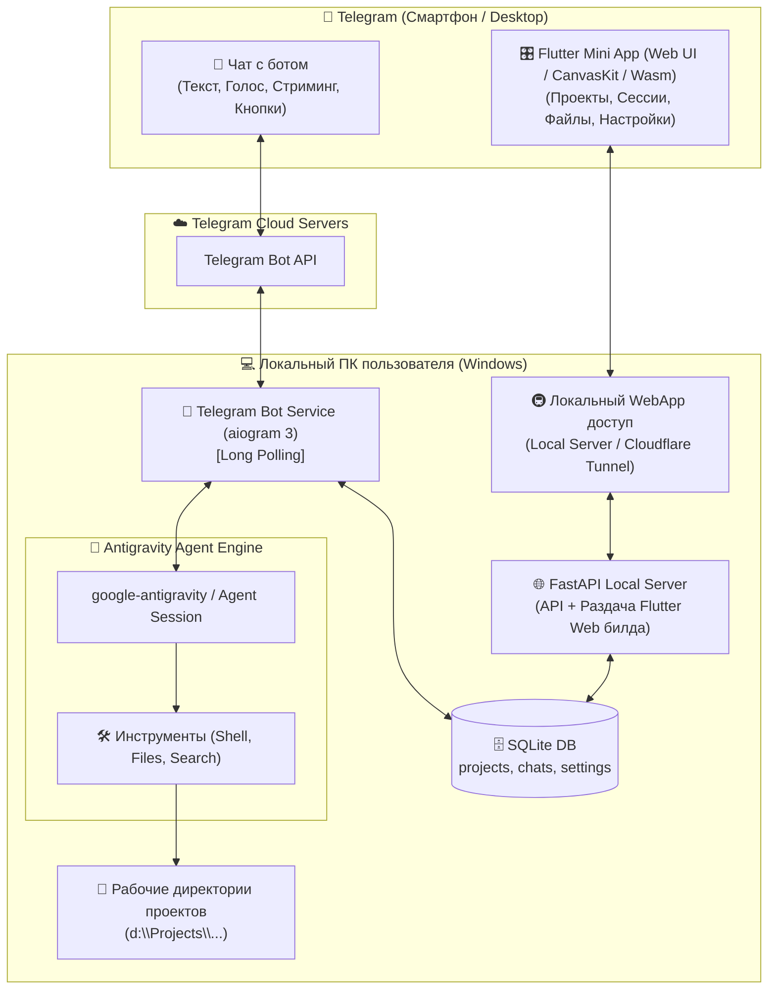

# Архитектура и План Реализации: Antigravity Telegram Bot & Flutter Mini App

Создание персонального AI-ассистента и моста управления **Antigravity** через Telegram на базе `aiogram 3`, Python SDK `google-antigravity`, локального backend-сервера (FastAPI) и встроенного **Flutter Web Mini App (TMA)** для визуального управления проектами и беседами.

---

## Архитектура системы



---

## Основные возможности

1. **Двусторонний диалог в Telegram (Native Chat)**:
   * Непрерывный контекст (multi-turn), сохранение памяти сессии.
   * Динамический стриминг: живое обновление одного сообщения (`💭 Думаю...` $\to$ `🛠 Выполняю: ...` $\to$ текст ответа).
   * Голосовые сообщения: автоматическая транскрипция через Gemini Multimodal / Whisper.
   * Входящие изображения и файлы: отправка скриншотов ошибок и логов прямо в чат.
   * Кнопка отмены `[ ⏹ Стоп ]` / `/cancel` для прерывания долгих операций.
   * Гибридный режим безопасности: `/auto` (полная автономность) и `/confirm` (подтверждение опасных команд кнопками).

2. **Управление проектами и беседами**:
   * **Проекты**: каждый проект привязан к локальной папке (например, `d:\Projects\active\antigravity_bot`).
   * **Беседы**: внутри проекта можно создавать любое количество именованных бесед, переключаться между ними или создавать новые (`/new`).
   * База данных SQLite хранит список проектов, историю диалогов, токены и настройки.

3. **Telegram Mini App на Flutter Web**:
   * Открывается по кнопке меню `🎛 Меню управления` в Telegram.
   * Разработано на **Flutter 3.44+ (Dart)** с нативными виджетами Material 3 / Telegram Theme.
   * **Экран "Проекты"**: создание проектов, выбор рабочей папки, переключение активного проекта с плавными анимациями.
   * **Экран "Беседы"**: список всех сессий текущего проекта, поиск, удаление, переименование, переключение.
   * **Экран "Файлы и Diffs"**: дерево файлов проекта и просмотр изменений.
   * **Экран "Настройки"**: выбор модели (Gemini 3.7 Flash, LiteRT, etc.), переключатель режима безопасности, системный промпт.

---

## Важные архитектурные решения

> [!IMPORTANT]
> **Flutter Web сборка и хостинг:**
> * Flutter компилируется командой `flutter build web --release` в директорию `frontend_flutter/build/web/`.
> * FastAPI сервер монтирует скомпилированную статику Flutter Web и раздает её по HTTPS через встроенный туннель для мобильного Telegram.

> [!TIP]
> **Авторизация:**
> * Бот принимает команды исключительно от вашего `TELEGRAM_ADMIN_ID`. Посторонние пользователи получат отказ в доступе.

---

## Структура файлов проекта

```
d:\Projects\active\antigravity_bot\
├── wiki/                      # Документация и архитектурные планы
│   ├── implementation_plan.md
│   ├── roadmap.md
│   ├── checklist.md
│   ├── activity_log.md
│   └── bug_tracker.md
├── frontend_flutter/          # Flutter Web проект (Telegram Mini App)
│   ├── pubspec.yaml
│   ├── web/
│   │   └── index.html         # Интеграция Telegram WebApp JS SDK
│   └── lib/
│       ├── main.dart          # Точка входа, тема Telegram WebApp
│       ├── models/            # Модели Project, Session, Settings
│       ├── services/          # HTTP API клиент к FastAPI
│       ├── providers/         # State management (Riverpod / Provider)
│       └── screens/           # Экраны Проектов, Бесед, Настроек
├── data/                      # База данных SQLite и сохраненные сессии
│   └── bot.db
├── src/
│   ├── __init__.py
│   ├── config.py              # Загрузка .env и валидация настроек
│   ├── database.py            # SQLite ORM / менеджер проектов и сессий
│   ├── agent/                 # Интеграция с Antigravity SDK
│   │   ├── __init__.py
│   │   ├── manager.py         # Управление жизненным циклом сессий и переключением
│   │   └── executor.py        # Стриминг, выполнение инструментов и хуки
│   ├── bot/                   # Модули Telegram-бота (aiogram 3)
│   │   ├── __init__.py
│   │   ├── handlers/
│   │   │   ├── chat.py        # Обработка текста, голосовых, изображений
│   │   │   ├── commands.py    # Команды /start, /new, /projects, /status, /cancel
│   │   │   └── callbacks.py   # Обработка inline-кнопок (подтверждения, выбор)
│   │   └── middlewares.py     # Whitelist авторизация по ADMIN_ID
│   └── server/                # FastAPI backend для Flutter Mini App
│       ├── __init__.py
│       ├── app.py             # REST API + монтирование Flutter build/web/
│       └── tunnel.py          # Авто-запуск HTTPS туннеля для Mini App
├── .env.example               # Шаблон конфигурации окружения
├── requirements.txt           # Зависимости Python
├── run.py                     # Единая точка запуска (Бот + Web Server)
└── README.md                  # Инструкция по настройке и запуску
```

---

## Описание компонентов

### 1. Инфраструктура и Зависимости
* `requirements.txt`: `aiogram>=3.17.0`, `fastapi>=0.115.0`, `uvicorn>=0.34.0`, `google-antigravity`, `google-genai`, `aiosqlite>=0.21.0`, `python-dotenv>=1.0.0`, `pydantic>=2.10.0`.
* `frontend_flutter/pubspec.yaml`: Flutter Web, `http`, `flutter_riverpod`, Telegram WebApp interop.

### 2. База данных и Хранилище (SQLite)
* `src/database.py`:
  * Таблицы `projects` (управление рабочими каталогами), `sessions` (сохраненные беседы), `settings` (конфигурация).
  * Методы для динамического переключения активного проекта и сессии.

### 3. Движок Агента (Antigravity Agent Manager)
* `src/agent/manager.py`: управление сессиями агента, переключение рабочих папок, прерывание задач (`abort_task`).
* `src/agent/executor.py`: хуки выполнения инструментов, стриминг в Telegram с throttling, обработка режима подтверждений опасных команд.

### 4. Telegram Бот (aiogram 3)
* `src/bot/middlewares.py`: проверка `TELEGRAM_ADMIN_ID`.
* `src/bot/commands.py`: команды управления (`/start`, `/new`, `/projects`, `/chats`, `/mode`, `/cancel`, `/status`).
* `src/bot/handlers/chat.py`: обработка текста со стримингом, транскрипция голосовых сообщений, парсинг изображений/файлов.
* `src/bot/handlers/callbacks.py`: обработка нажатий inline-кнопок.

### 5. Flutter Mini App (Frontend) & FastAPI (Backend)
* `src/server/app.py`: FastAPI REST API для управления проектами и сессиями + раздача `frontend_flutter/build/web`.
* `frontend_flutter/`: полноценное кроссплатформенное приложение Flutter с поддержкой темной/светлой темы Telegram и реактивным состоянием.

### 6. Точка Входа
* `run.py`: единовременный запуск веб-сервера и Telegram-бота в одном asyncio event loop.
